# Roadmap Visualization

A single picture of where the lab has been, what is settled, and what comes
next. It is a projection of the authoritative plan — the phase view in
[roadmap.md](roadmap.md) and the experiment-driven plan (results ledger, open
questions, tracks, and decision gates) in
[research-roadmap.md](research-roadmap.md). When this diagram and those documents
disagree, those documents win.

## Phases and tracks

```mermaid
flowchart TD
    classDef done fill:#1f7a3d,stroke:#0c3d1e,color:#ffffff;
    classDef next fill:#1f5fa8,stroke:#0c2f55,color:#ffffff;
    classDef deferred fill:#7a6a1f,stroke:#3d350c,color:#ffffff;
    classDef gate fill:#8a2b2b,stroke:#451414,color:#ffffff;

    %% ---- Phase backbone (P0 -> P4) ----
    P0["P0 Public foundation<br/>schemas + CLI + gates + synthetic fixture"]:::done
    P1["P1 Curated GitHub dataset<br/>20-repo pilot: 2,087 records, 356 fixes edges"]:::done
    P2["P2 Relational embedding benchmark<br/>baselines + cross-repo + embeddings + LoRA"]:::done
    P3["P3 GraphRAG + dry-run agent policy<br/>subgraph packing, tool/test selection"]:::deferred
    P4["P4 Public release<br/>position paper + cards + checklist"]:::deferred

    P0 --> P1 --> P2 --> P3 --> P4

    %% ---- The P2 experimental arc (the heart of the work so far) ----
    SUB["Synthetic per-token ablation<br/>relation 0.82 >> IDF 0.38 >> vanilla 0.11 (R@1)"]:::done
    XTOK["Cross-token synthetic<br/>two-tower 0.83 vs all-else 0.01 (R@1)"]:::done
    PILOT["Real issue->PR (explicit link)<br/>IDF 0.46 ties diagonal 0.45 (R@1)"]:::done
    XREPO["De-referenced + cross-repo (bag-of-tokens)<br/>tower 0.24 < vanilla 0.39 (R@1)"]:::done
    EMBED["Frozen embeddings substrate (MiniLM-L6)<br/>embedder-cosine 0.59 wins; bolt-on head fails"]:::done
    LORA["LoRA fine-tune (Track A) -- FIRST RELATIONAL WIN<br/>0.66 > frozen 0.59 (R@1), cross-repo held-out"]:::done

    P2 --> SUB --> XTOK --> PILOT --> XREPO

    %% ---- Decision gates as diamonds ----
    G1{"Does the synthetic<br/>win transfer to real data?"}:::gate
    XTOK --> G1
    G1 -- "no: surface-rich, IDF strong" --> PILOT

    G2{"Can bag-of-tokens<br/>generalize cross-repo?"}:::gate
    XREPO --> G2
    G2 -- "no: tokens don't transfer,<br/>only meaning does" --> EMBED

    G3{"Does a relation head help<br/>on FROZEN embeddings?"}:::gate
    EMBED --> G3
    G3 -- "no: from-scratch overfits (0.19),<br/>identity-init ties (0.59)" --> LORA

    G4{"Does the relation loss INSIDE<br/>the representation win cross-repo?"}:::gate
    LORA --> G4
    G4 -- "YES (pilot scale): 0.59 -> 0.66" --> SCALE
    G4 -- "YES: contribution is in the rep" --> GNN

    %% ---- What comes next, branched off the Track-A win ----
    SCALE["Track D -- Scale on signal<br/>200-500 repos, multi-split CIs, code-specific base (Q6)"]:::next
    GNN["Track B -- Graph link prediction<br/>inductive GNN / KG-embedding on the enriched graph"]:::next
    GENRICH["Graph enrichment (Track B prereq) -- DONE<br/>736 file/test nodes, 1,356 modifies edges"]:::done
    TASKS["Track C -- Tasks & labels<br/>diff->test, log->file (Q3); cross-repo bug-class (Q4)"]:::deferred
    SLM["Track E -- Relational SLM (MVP-2+)<br/>QLoRA SLM + GraphRAG + agent policy"]:::deferred

    GENRICH --> GNN
    SCALE --> P3
    GNN --> P3
    GNN --> TASKS
    P3 --> SLM
    TASKS --> SLM
    SLM --> P4
```

## Legend

| Color | Meaning |
|---|---|
| Green | Done / settled with evidence (experiment cards committed). |
| Blue | Next — actively unblocked by the current gate outcome. |
| Yellow | Deferred — gated behind a signal or a later phase. |
| Red diamond | Decision gate — a falsifiable question whose answer routes the next step. |

## How to read it

- The **phase backbone** `P0 -> P4` is the coarse program (foundation, dataset,
  benchmark, GraphRAG/agent, release).
- The **P2 experimental arc** is the chain of one-change-at-a-time experiments
  that consumed most of the work so far. Each arrow into a gate carries the
  finding that decided the next step.
- The **four gates** are the load-bearing decisions:
  1. the synthetic win does **not** transfer to real data (surface-rich; IDF is
     the bar);
  2. bag-of-tokens **cannot** generalize cross-repo (tokens don't transfer, only
     meaning does);
  3. a relation head on **frozen** embeddings does **not** help at pilot scale;
  4. the relation loss **inside** the representation (LoRA) **does** win
     cross-repo — the first positive relational result.
- The **next** nodes (blue) branch off that final win: scale the win (Track D)
  and exploit graph structure (Track B, whose enrichment prerequisite is already
  done). `P3` (GraphRAG / dry-run agent policy) and Track E (relational SLM) stay
  deferred until MVP-1 shows the win holds at scale.

All numbers above are pulled from the ablation documents and the committed
experiment cards under [`data/cards/examples/`](../data/cards/examples/); they are
**exploratory, pilot-scale** signals to confirm, not settled results.
